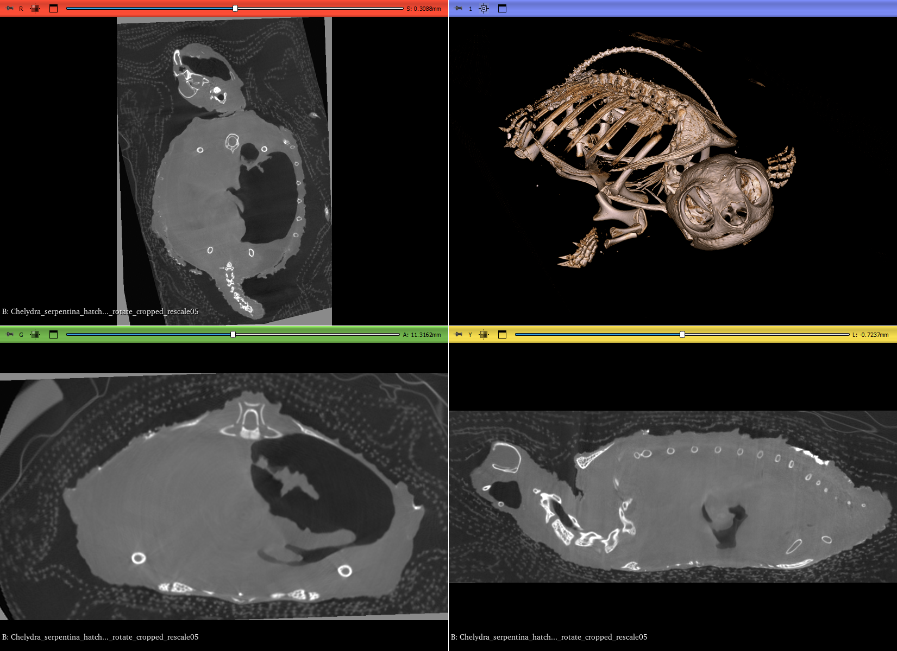

## MorphoDepot Repository
Repository for segmentation of a specimen scan.  See [this JSON file](MorphoDepotAccession.json) for specimen details.
* Species: Chelydra serpentina
* Modality: Micro CT (or synchrotron)
* Contrast: No
* Dimensions: (1040, 1496, 498)
* Spacing (mm): (0.0359999984499999, 0.0359999981060606, 0.03599999844999981)

## Screenshots

_Common snapping turtle (oblique anterior)_
